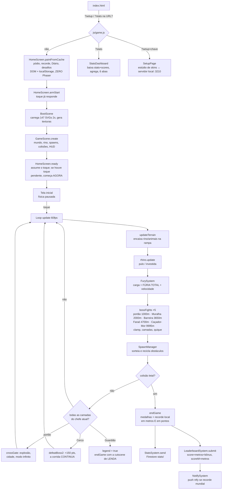

# Furious Rhino — Arquitetura

> Documentação da versão **1.9.7** · atualizada em 28/08/2026
> Visão técnica intermediária: como o projeto é organizado, os principais componentes e como eles conversam. Pressupõe noções de programação, mas explica os termos específicos do projeto.

## 1. Filosofia

Três decisões moldam tudo:

1. **Zero build, zero backend próprio.** O jogo é HTML + ES modules (módulos JavaScript nativos do navegador, sem empacotador tipo Webpack) servidos estáticos pelo GitHub Pages. O Phaser (engine de jogos 2D) vem de CDN. O "backend" é o Firebase Firestore (banco de dados na nuvem do Google) no plano gratuito, protegido só por *security rules* (regras declarativas de acesso avaliadas pelo próprio Firestore).
2. **Zero assets binários.** Personagens são SVG rasterizados em tempo de carga; cenário e obstáculos são desenhados por código (`TextureFactory`); todo o áudio é sintetizado via Web Audio API (API do navegador para gerar som programaticamente). O repositório não tem nenhum PNG/MP3 de jogo (só os ícones do PWA).
3. **Telemetria e ranking são acessórios.** Qualquer erro de rede ou de regra do servidor é engolido (`safeTelemetry`) — **nada disso pode derrubar o jogo**.

## 2. Mapa de componentes

```
index.html ─── HUD, telas e modais em DOM + CSS (~1300 linhas), carrega Phaser via CDN
    └── js/game.js ─── roteador: /?setup → estúdio · /?stats → painel · senão → jogo
         ├── [JOGO]
         │    ├── home/HomeScreen.js ──── A TELA INICIAL (v1.9.3): dona única da
         │    │                            pintura da home — pódio, degrau VOCÊ, campanha,
         │    │                            gráfico, Diário e cards de desafio. Pintada
         │    │                            ANTES do Phaser: é DOM + localStorage e
         │    │                            **não pode tocar em Phaser** (regra do arquivo)
         │    ├── scenes/BootScene.js ──── carrega SVGs (2×), gera texturas, cria animações
         │    ├── scenes/GameScene.js ──── A CENA ÚNICA: loop, colisões, terreno, biomas,
         │    │                            clima, portão, morte, telas, pausa (~2000 linhas)
         │    ├── entities/ ────────────── Rhino, Animal, CrackedWall, Spike, TranqTower,
         │    │                            TranqDart, Ramp, TimedHazard (armadilhas
         │    │                            temporizadas da cidade, v1.8.7), HunterSniper
         │    │                            (o atirador dos bosses — paramétrico)
         │    ├── systems/
         │    │    ├── TextureFactory ──── toda a arte procedural (24 geradores)
         │    │    ├── SpawnManager ────── sorteio e reciclagem de obstáculos (pools)
         │    │    ├── FurySystem ───────── fúria = CARGA por distância → velocidade, tint,
         │    │    │                        fumaça; e o modo FÚRIA TOTAL (rampage)
         │    │    ├── BossFight ────────── luta de chefe PARAMÉTRICA (v1.8.5): uma `def`
         │    │    ├── BossProof ────────── a PROVA DO CHEFE (v1.9.6): módulo PURO com o
         │    │    │                        invariante "não se passa por um chefe que não foi
         │    │    │                        derrubado". Três consumidores — o envio ao ranking,
         │    │    │                        a Arena de Desafios e o tools/fix-ranking.mjs
         │    │    │                        por boss — portão (1000m), Muralha (2000m),
         │    │    │                        Barreira da Escavação (3650m), Faraó de
         │    │    │                        Bronze (4700m) e Guardião do Fim (9995m) —
         │    │    │                        cinco instâncias da MESMA classe
         │    │    ├── AudioSystem ──────── SFX + música generativa (Web Audio)
         │    │    ├── SkinSystem ───────── skins (v1.8): lógica de acesso (4 tipos com
         │    │    │                        condições declarativas), resolução da equipada
         │    │    ├── SkinRegistry ─────── DADOS das skins (JSON estrito, machine-owned:
         │    │    │                        reescrito pelo estúdio /?setup)
         │    │    ├── MedalSystem ──────── 27 medalhas locais (ids imutáveis, append-only)
         │    │    ├── ScoreSystem ───────── pontuação composta (v1.8.4): pesos por façanha,
         │    │    │                        teto do bônus, recomputação de runs[] e formatação
         │    │    │                        (módulo PURO — sem Phaser, testado no node)
         │    │    ├── LeaderboardSystem ── ranking (Firestore: scores/, score=total + scoreM=metros)
         │    │    │                        + pódio da home (cache 6h)
         │    │    ├── ChallengeSystem ──── Arena de Desafios (v1.8.6): desafio = metadado em
         │    │    │                        challenges/, placar DERIVADO do stats/ público dos
         │    │    │                        aceitos (zero write cruzado; caches TTL 1h/30min)
         │    │    ├── NewsSystem ───────── Diário da Fuga (config/news do console + eventos locais)
         │    │    ├── StatsSystem ──────── telemetria (Firestore: stats/)
         │    │    ├── NotifySystem ─────── pushes ntfy do administrador
         │    │    ├── ReassignSystem ───── recuperação de identidade (v1.9.0): pedido 🆘,
         │    │    │                        consulta gated ao config/reassign e a adoção
         │    │    │                        do id antigo (mergeIdentity PURO — testado no
         │    │    │                        node; totais SOMADOS pela monotonia das rules)
         │    │    └── TuningPanel ──────── painel de debug (?debug=1, lil-gui via CDN)
         │    └── utils/
         │         ├── Constants.js ─────── TODO o tuning numérico (fonte única). No fim do
         │         │                        arquivo, o MERGE da calibração do dono: aplica
         │         │                        art/SpriteParams.js por cima das tabelas
         │         ├── StorageManager.js ── tudo que persiste no aparelho (localStorage)
         │         └── ../art/SpriteParams.js ─ DADOS de calibração de sprites (v1.8.9):
         │                                  overrides por espécie + espécies NOVAS criadas
         │                                  pela aba Sprites (JSON estrito, machine-owned)
         ├── [PAINEL /?stats]
         │    ├── stats/StatsDashboard.js ─ baixa as coleções, agrega no cliente, 6 abas
         │    ├── stats/Charts.js ───────── primitivas de gráfico em SVG, zero dependência
         │    ├── stats/MyStats.js ──────── modal "Minhas estatísticas" (também usado no jogo)
         │    └── stats/RadiografiaCore.js  o agregador PURO da radiografia (v1.8.7): recebe
         │                                  as coleções decodificadas e devolve métricas +
         │                                  motor de insights + markdown — roda no navegador
         │                                  (aba 📊 do estúdio) e no node (npm run radiografia)
         └── [ESTÚDIO /?setup=chave] — quatro abas, carregadas sob demanda
              ├── setup/SetupPage.js ────── moldura + aba 🎨 Skins (wizard de criação, lista
              │                             com editar/esconder/remover) + card Servidores
              ├── setup/SetupSprites.js ─── aba 🖼️ Sprites (v1.8.9): catálogo animado das
              │                             espécies, editor de parâmetros, gerador de
              │                             inimigo e a atribuição (substituir arte /
              │                             criar espécie nova)
              ├── setup/SetupAnalytics.js ─ aba 📊 Radiografia (v1.8.7): fetch público +
              │                             render dos insights (usa o RadiografiaCore)
              └── setup/SetupReassign.js ── aba 🆘 Recuperação (v1.9.0): confere a
                                            reivindicação (leituras públicas) e autoriza/
                                            conclui via servidor local — que escreve o
                                            config/reassign com a credencial do login do
                                            firebase-tools (clientes só LEEM o doc)
```

Fora do runtime: `sw.js` (service worker do PWA), `firestore.rules` (versionadas aqui, publicadas à mão no console), `tools/*.mjs` (testes e utilitários Node), `.github/workflows/daily-digest.yml` (resumo diário via cron) e `gerador-de-sprites/` (ferramenta local de conversão de arte raster em skins — ver §12).

## 3. Fluxo principal



Pontos que merecem destaque:

- **Uma cena só.** Não há cena de menu/game-over separada: as "telas" são divs de DOM sobre o canvas, e `GameScene` pausa/retoma a física. Reiniciar é recarregar a página.
- **A tela inicial não depende do motor (v1.9.3).** `js/game.js` chama
  `HomeScreen.paintFromCache()` **antes** de instanciar o Phaser: a home é DOM +
  `localStorage` e não usa uma única textura do motor (o rino da abertura são 3
  `` com animação CSS). Antes disso ela era montada dentro do
  `GameScene.create()`, ou seja, depois dos 147 SVGs do preload — e ficava **4,6 s
  vazia no celular depois de a página estar pronta**. O `HomeScreen` é o **dono
  único** da pintura: a cena mantém os mesmos nomes de método, mas delega.
- **O toque é armado antes da cena existir.** Como a home fica pronta em ~0,6 s e o
  motor só aos ~6 s, existe uma janela em que dá para tocar sem dar para jogar. O
  `armStart` **guarda** o toque (CTA vira "preparando a fuga...") e o `ready` da cena
  dispara a partida sozinho. O `startTriggered` do `startRun` impede partida dupla.
- **`updateTerrain()` roda antes de `rhino.update()`** — ordem obrigatória, ver §5.
- **A vitória mudou de dono na v1.7**: quem chama `crossGate()` é o `BossFight` ao cair a 3ª camada (não mais a linha de x = 40000). O gatilho antigo por posição continua como *fallback* do modo invencível de debug — e por isso **teleportar para além do portão nos testes exige `invincible = true`**, senão o clamp da arena devolve o rinoceronte para a face do portão.
- **O handler de pânico grava, mas não pontua (v1.9.5)**: o `crashToHome` — a rede de proteção da v1.9.1 para exceção dentro do `update` — passou a chamar `addRun(..., 'crash')` antes de parar a cena. Continua sem recorde, sem pódio e sem envio de telemetria; o que mudou é que a corrida **anômala**, justamente a que a investigação precisa ver, parou de apagar a própria evidência. A leitura roda em `try/catch` próprio e só toca o essencial: numa cena meio destruída, cada acesso a mais é uma chance a mais de o handler de pânico entrar em pânico.
- **`addRun` e `recordRun` andam juntos (v1.9.5)**: os dois registram a MESMA corrida, mas estavam separados por 180 linhas de manipulação de DOM no `endGame`, com catorze `getElementById(...).textContent` desprotegidos no meio. A assimetria era cruel — `attempts` é idempotente e o envio seguinte cura, enquanto `history.days[dia].r` é **incremento** e o que se perde ali não volta. É a mesma família do bug que a v1.9.1 corrigiu invertendo a ordem do `endGame`.
- **O BossFight é paramétrico (v1.8.5)**: a classe recebe um objeto de definição (`def`) com âncora, camadas (na ordem de quebra — pode repetir altura), tabela de tiro, texturas, contadores e os callbacks `isBypassed`/`onDefeat`. Os três chefes são três instâncias em `scene.bossFights[]` (o alias `scene.bossFight` continua sendo o do portão, para telemetria e testes). Cada vitória tem dono: o portão chama `crossGate()`; o **Cerco** chama `defeatBoss2()` — explosão, +150 pts e a corrida **continua**; o **Guardião** seta `legend` e chama `endGame(true)` — a cutscene de LENDA vira a festa do chefe. O `HunterSniper` lê a tabela da `def` e ganhou três capacidades ativáveis por tabela: `fan` (leque de 3 dardos), `rasante` (tiro rente ao chão, anti-camping) e o *enrage* suave (passado `enrageMs` de luta, a cadência desce UM degrau — nunca um muro de morte). A causa de morte viaja no dardo: `fromBoss` virou a **string** da causa (`boss`/`boss2`/`boss3`).
- **`isBypassed` só vale em DEBUG (v1.9.4) — e o porquê é a armadilha mais cara do projeto até hoje**: cada `def` tem um `isBypassed` que rende o chefe quando o rinoceronte já está além da âncora dele. Ele nasceu na v1.8.5 para o **teleporte do painel** (`?debug=1`), que cruza a âncora dentro do mesmo quadro e acordava um chefe dormente, que então clampava o rino de volta. Só que a guarda rodava **na partida normal também**. Combinada com o gatilho legado de `crossGate()` por posição — que igualmente deveria ser exclusivo do modo invencível —, ela virou uma **cascata**: um único quadro longo (85 ms atravessam os 120 px entre a face do portão e a linha do gatilho) declarava a fuga sem luta, e daí cada chefe seguinte via-se ultrapassado e se rendia, até o fim do mundo. **Os cinco chefes ficaram atravessáveis da v1.8.5 à v1.9.3** sem que nenhum teste acusasse, porque todo teste automatizado roda em debug — o único ambiente em que a guarda era legítima. Hoje os cinco `isBypassed` e o gatilho legado exigem `scene.registry.get('debug')` / `this.invincible` explicitamente.
- **A prova do chefe é uma SEGUNDA pergunta, não uma versão melhor da primeira (v1.9.6)**: `LeaderboardSystem.isPlausible` julga **física** (a velocidade média era possível?) e `beatEveryBossPassed` julga a **regra do jogo** (todo chefe ultrapassado foi derrubado?). São independentes de propósito, porque a cascata provou que uma marca pode ser fisicamente impecável e mesmo assim falsa — atravessar o mundo a 11 m/s é o ritmo de qualquer jogador. A lista de chefes vem do **elenco real da cena** (`chefesDaCena(this.bossFights, this)`), nunca de uma tabela paralela: chefe fora do elenco não cobra ninguém, e chefe sem contador de camadas não acusa. É o que impede a régua de envelhecer quando o jogo muda.
- **A faxina do aparelho roda no boot, antes da home (v1.9.6)**: `LeaderboardSystem.purgeUnprovenLocal()` é chamada no `bootGame()` porque a tela inicial pinta logo em seguida e os cards da Arena de Desafios já leem o `runs[]` local. Ela existe porque limpar o Firestore não basta — **o aparelho regrava a janela por cima na partida seguinte**, e foi o que desfez a correção de 25/08 em um dia. Além de remover as corridas, ela recomputa o `bestSent` local: sem isso os jogadores corrigidos ficam **impedidos de pontuar**, porque o `shouldSubmit` exige superar uma marca que já não é deles. É idempotente (marca própria no `localStorage`) e só DESCE — a janela de 50 rotaciona, e baixar por falta de prova seria roubar a marca de quem tem o recorde fora dela.
- **A regra que ficou disso**: guarda que existe para uma ferramenta de desenvolvimento tem de **perguntar pela ferramenta**, não pelo efeito colateral dela. E teste que só roda em debug não prova nada sobre a partida real — o `e2e-boss` ganhou na v1.9.4 o assert que reproduz a cascata (pôr o rino além do gatilho e verificar que os cinco chefes **não** se rendem).
- **O portão não interrompe o loop**: `crossGate()` roda uma vez, dispara os efeitos e a corrida segue na mesma passada. Durante a luta a câmera fica **travada** (`stopFollow`) — de brinde, o lookahead do spawn não alcança o pós-portão e **nada nasce na arena** sem precisar de código extra.
- **A fúria respeita a arena (v1.8)**: com `BOSS_BLOCKS_FURY` ligado, `FurySystem.activate()` recusa a ativação enquanto **qualquer** luta de `scene.bossFights[]` estiver em `state === 'fight'` (guarda canônica — cobre toque, teclado e debug de uma vez; o feedback de UI mora no `doSpecial` da `GameScene`). Um rampage ativado antes da arena sobrevive, mas o `BossFight` deixou de aceitar quebra desalinhada por fúria — a checagem de alinhamento voltou a ser obrigatória para todo mundo. O aviso de "medidor cheio" que acontecer durante o bloqueio fica **pendente** e dispara na liberação.

## 4. Ciclo de vida dos obstáculos (SpawnManager)

- **Pools de reuso** (object pooling — reutilizar objetos em vez de criar/destruir, essencial para não travar em celular): 8 paredes, 8 espinhos, **16 animais**, 4 torres, 16 dardos, 4 rampas.
- O spawn olha `SPAWN_LOOKAHEAD_PX` à frente da câmera e sorteia pela **roleta de pesos do tier atual** (`Constants.DIFFICULTY_TIERS`, 6 níveis, um a cada 200 m). O que sobra dos pesos vira animal.
- **Densidade de animais além da roleta** (v1.8): dois mecanismos somam animais sem substituir obstáculo nenhum — o **par** (`animalPackChance`: sorteou animal, chance de um segundo a 300 px) e a **escolta** (`animalEscortChance` + `maybeEscort()`: parede/espinho/torre pode nascer com um animal logo atrás, na coreografia dos combos). Os dois respeitam as zonas livres da arena do boss e da chegada. O teto do sistema é ~4 animais/100 m — a partir daí só mexendo nos pesos (o que troca letalidade por bicho).
- Obstáculo que sai da tela pela esquerda volta ao pool.
- **A espécie do animal sai do elenco do bioma local** (`BIOME_ANIMALS` + `pickBiomeAnimal(x, modo)`, v1.7): 27 espécies, cada trecho com as suas — e os combos pedem o modo certo (`ground` para o par parede+animal, `fly` para espinho+rasante).
- **Abertura roteirizada** (`OPENING_SCRIPT`): os 3 primeiros obstáculos são fixos (rampa → espinho → parede, em ordem de lição); a roleta só assume aos 190 m.
- A partir do tier 3 entram **combos** (pares de obstáculos com offset fixo, ex.: parede + animal logo atrás, que força pular em vez de investir duas vezes).
- **As arenas de boss são zonas livres unificadas (v1.8.5)**: `noSpawnZones()` descreve as zonas como DADOS (`{from, to, resumeX, anchor}`) — arena do portão (WIN−1300 a WIN+1000), arena do Cerco (mesma geometria em 80000) e a chegada da LENDA (últimos 1500 px, onde o Guardião mora de graça). `inNoSpawnZone(x)` substitui as 4 cópias antigas da checagem (laço principal, par de animais, escolta e `rampFits`), e `nearBossArena(x)` impede o combo de partir um par na aproximação de qualquer âncora. Depois do portão (x ≥ 40000), todo obstáculo nasce com **skin `-city`** (mesmas hitboxes, outro grafismo).

## 5. A decisão arquitetural mais importante: rampa é terreno, não colisão

O Phaser Arcade Physics só entende **AABB** (caixas de colisão alinhadas aos eixos — sem superfícies inclinadas). Uma escada de corpos estáticos foi testada e descartada: a separação de colisão zera a velocidade, o `FurySystem` a reescreve no frame seguinte e o rinoceronte fica **tremendo, preso na lateral do degrau** — soft-lock, pior que morte.

A solução: a rampa **não tem corpo físico**. Ela expõe uma função pura `surfaceY(x)` e a `GameScene.updateTerrain()` **encaixa** o corpo do rinoceronte (e dos animais terrestres) nessa superfície uma vez por frame, escrevendo os flags `blocked.down` à mão. Consequências:

- `Rhino.js` nem sabe que rampas existem.
- Não há tunelamento em fps baixo — é um encaixe posicional por X, não colisão varrida.
- Precisa rodar **depois do step de física e antes de `rhino.update()`** (senão a física apaga os flags).

**Os alvos dos bosses (v1.7; três desde a v1.8.5) seguem o mesmo princípio.** Nenhum deles tem corpo físico: o contato é uma banda de x em altura total + um *clamp* posicional (a posição é limitada, nunca a velocidade), e o recuo é o `Rhino.beginKnockback()` — que abre uma janela em que o `FurySystem` **não reescreve** `velocityX` (a reescrita por frame contra um corpo sólido é exatamente a receita do soft-lock das rampas). O recuo decai sozinho e, quando a janela fecha, a reescrita normal reacelera o rinoceronte para a frente — e a investida volta do cooldown **junto com o controle**.

## 6. Dados: o que vai para onde

| Dado | Onde mora | Observação |
|---|---|---|
| Recorde, medalhas, apelido, totais, últimas 50 corridas, histórico de 60 dias | **localStorage** do aparelho (via `StorageManager`) | O jogo funciona 100% offline com isso |
| Ranking (`{name, nameLower, score, scoreAt, skin}`) | Firestore **`scores/{playerId}`** | `playerId` = UUID aleatório do aparelho. Escrita só melhora o próprio score. `scoreAt` (v1.8) = quando a marca foi atingida — alimenta o "há X dias"; `skin` (v1.8.1) = a skin usada ao cravar a marca — a vitrine do pódio da home. A troca de apelido **preserva os dois** (cópias locais `best_sent_at`/`best_sent_skin`); docs antigos caem nos fallbacks (`updatedAt` / rino original) |
| Pódio da home (top 3 + skins) | **localStorage** `furious_rhino_podium` `{at, entries}` | Cache com TTL de 6h (`fetchPodium`, 3 reads); o `fetchTop10` do modal realimenta de graça; offline usa a última foto. Dias no pódio = `holdDays(..., {cascade:true})` — posse da POSIÇÃO; a lista do 🏆 segue por marca |
| Diário da Fuga | Firestore **`config/news`** (avisos do dono, campo `items` de strings; write só pelo console) + **localStorage** `furious_rhino_news` (eventos locais, dedupe por chave, cap 10) | `NewsSystem`: cache remoto de 1h (molde do `config/notify`); 1º card = 1º aviso do dono, resto = eventos do jogador |
| Telemetria (tentativas, tempo, mortes por causa/tier, mecânicas por corrida, aparelho, geo aproximada) | Firestore **`stats/{playerId}`** | 1 write idempotente por fim de corrida, com **totais acumulados** (`setDoc` sem merge) |
| Configuração dos pushes | Firestore **`config/notify`** | Só o console do Firebase escreve (`allow write: if false`) |

Regras de ouro (detalhes em [`04-referencia-tecnica.md`](04-referencia-tecnica.md)):

- **Nunca criar campo novo de primeiro nível em `stats`** — o orçamento de avaliação das rules estoura (19 campos passavam, 20 falhavam) e os writes passam a ser negados **em silêncio**. Campo novo entra dentro dos mapas existentes ou dos elementos de `runs[]` (cuja forma não é validada).
- **Publicar `firestore.rules` no console ANTES do deploy** de código que dependa delas.
- Privacidade: nenhum IP é armazenado; a geolocalização (país/região/cidade) é consultada no cliente e só o resultado é gravado.
- **Ambiente de TESTE não escreve por padrão** (v1.7.2, ampliado na v1.9.6): `StorageManager.allowsRemoteWrite()` bloqueia toda escrita em `scores`/`stats` a menos que um teste peça explicitamente (`furious_rhino_allow_local_write` no `localStorage`, semeado antes da página carregar). Até a v1.9.5 "ambiente de teste" era só o hostname (`localhost`/`127.0.0.1`/IP de rede local); **desde a v1.9.6 o `?debug=1` entra na mesma categoria**. O painel de tuning é público — basta o parâmetro na URL — e traz teleporte de chefe e modo invencível; em 25-26/08 um jogador de produção usou isso e três marcas sem luta subiram ao ranking mundial. O opt-in não mudou: é o mesmo que o painel expõe como "📡 Escrita local", então nenhum fluxo novo nasceu. Fecha também a causa raiz dos vazamentos de teste — antes disso, um contexto que esquecesse de semear um `playerId` de sonda minava um UUID real e escrevia de verdade.

## 7. O painel `/?stats`

`js/game.js` detecta `?stats` na URL e **nem baixa o Phaser** (1,2 MB economizados — o `document.write` do CDN é condicional no `index.html`). O `StatsDashboard`:

1. Baixa as coleções `stats` e `scores` **inteiras** e agrega tudo no cliente (barato no volume atual; sem servidor, não há onde agregar).
2. Filtra documentos de sonda (ids `claude-*`, usados pelos testes).
3. Renderiza 6 abas com gráficos SVG desenhados à mão (`Charts.js` — zero dependência).
4. As abas detalhadas exigem a chave (`?stats=0929`), conferida por hash SHA-256 no cliente — afasta curiosos, não é segurança (a leitura da coleção é pública por design).

## 8. Notificações (NotifySystem + daily-digest)

Configuração em **três camadas**, da mais forte para a mais fraca — a de cima vence:

1. `/?ntfy=off` no navegador (só aquele aparelho, gravado em localStorage);
2. doc `config/notify` no Firestore (todos, sem deploy, cache de 1 h);
3. `js/notify-config.js` (defaults versionados; **`topic` vazio = sistema inteiro desligado**, então um clone do repositório não notifica ninguém).

Os pushes são POSTs JSON direto do navegador para o ntfy (o tópico vai no corpo, mantendo a requisição *simple* e evitando preflight CORS). O resumo da sessão usa `sendBeacon` (API que garante o envio mesmo com a página fechando).

O **resumo diário** é outro caminho: `tools/daily-digest.mjs` roda num cron do GitHub Actions (23h UTC), lê o Firestore via REST e publica no ntfy — **não passa** pelo `config/notify`.

## 9. PWA e cache

`sw.js` usa **duas estratégias desde a v1.9.7** (antes era network-first para tudo): **JS/HTML** seguem network-first estrito com `cache: 'no-cache'` — misturar versões deles foi o desastre da v1.4.0 —; a **arte** (`art/*`) é cache-first com revalidação em segundo plano (SWR), porque misturá-la é cosmético e revalidar ~150 SVGs por sessão era metade do preload lento (dívida nº 3 da radiografia de 24/08). Pontos críticos:

- `ASSETS` lista **todos** os arquivos, um a um. Arquivo `.js` novo → entra na lista **e** a constante `CACHE` sobe de versão (`furious-rhino-v161`), senão quem tem o PWA instalado toma 404.
- Hosts externos (`googleapis.com`, `geojs.io`, `ipwho.is`, `ntfy.sh`) têm **bypass** total do cache — serviço externo novo precisa entrar nessa lista.
- **A corrente de socorro (v1.9.7, CASO 2)**: falhou a rede → o próprio recurso do cache com `ignoreSearch` → em navegação, o shell (`./index.html`) → em navegação sem cache NENHUM, uma **página de socorro gerada dentro do SW** ("Sem conexão com o jogo" + tentar de novo). Antes, um miss devolvia `undefined`, e `respondWith(undefined)` é erro de rede garantido — o SW **fabricava** a página "não foi possível acessar" que um jogador real viu. Subrecurso sem cache segue falhando de propósito: é o sinal certo para a rede de proteção da página (v1.9.1) agir.
- **Instalação tolerante (v1.9.7)**: `allSettled` arquivo a arquivo em vez do `addAll` atômico — UM item falhando (rede móvel, CDN, janela de deploy) prendia o cliente no SW velho, cujo `put` misturava arquivos novos no cache antigo. Só o **núcleo** (tudo que não é `./art/`) segue obrigatório: cache que não boota é pior que permanecer no SW anterior.
- **`navigator.storage.persist()`** é pedido no boot (`game.js`): sem ele o navegador pode despejar o cache inteiro sob pressão de espaço — Safari/iPadOS é o mais agressivo, e os dois suspeitos do CASO 2 eram Apple.

## 10. Testes e ferramentas

| Comando | O que é |
|---|---|
| `npm run test-stats` | 99 asserts de telemetria/agregação, puro Node (sem navegador), inclusive checagem de consistência contra `firestore.rules` e as letras `e/h/l` + causas `boss2`/`boss3` dos bosses novos |
| `npm run test-skins` | ~95 asserts puro Node (v1.8, nº varia com o registry): lógica de acesso com skins sintéticas (rank exato/conquista/totais/hidden), resolução da equipada sem regravar a escolha, retro-scan, consistência registry ↔ `art/` ↔ `sw.js` |
| `npm run test-ramp` | 30 asserts e2e (teste de ponta a ponta, com navegador de verdade via Playwright): grava a trajetória frame a frame na travessia da rampa, portão, cidade, teclado, pausa |
| `npm run test-boss` | 16 asserts e2e da luta do portão: o quique nunca trava nem mata (anti-soft-lock), a investida volta na janela pós-quique, as 3 quebras em ordem, morte pelo rifle com causa própria — e, na v1.8, a fúria negada na arena (carga preservada, cadeado, paridade de teclado, liberação pós-derrota) |
| `npm run test-boss2` | 13 asserts e2e do Cerco (v1.8.5): ordem não-monotônica mid→ground→high→mid, leque/rasante, enrage, fúria negada — e o assert-chave: **a 4ª camada NÃO chama `crossGate`** (a corrida continua, com +250 pts ao vivo) |
| `npm run test-boss3` | 10 asserts e2e do Guardião (v1.8.5): palíndromo de 5 camadas, arena dentro da zona da LENDA, morte com causa `boss3` — e o assert-chave: **a 5ª camada dispara a LENDA** (`legend`/`won`, overlay com o breakdown do chefe) |
| `npm run test-special` | 25 asserts e2e: sorteio por bioma, o ciclo completo da FÚRIA TOTAL (carga, ativação, destruição, drenagem) e o desabamento do topo da parede (crop, tombo, limpeza do pool) |
| `npm run test-e2e-skins` | 15 asserts e2e (v1.8): preview e sprite vestem a skin, pódio dinâmico (destronado → default sem regravar), hub não inicia corrida, persistência após reload, fúria com `firePrefix` próprio (registry canônico injetado com arte do núcleo) |
| `npm run test-e2e-stats` | e2e da telemetria real contra o Firestore (com id de sonda `claude-*`), painel, resiliência, e prova de que a suíte **não sujou a produção** |
| `npm run test-score` | 83 asserts puro Node da pontuação composta: pesos, teto do bônus, recomputação de `runs[]` idêntica à soma ao vivo, formatação pt-BR |
| `npm run test-challenge` | 77 asserts puro Node da Arena: janelas, papéis, validação de criação, sanitização do doc, **cancelamento** (rules do `cancelledAt`) |
| `npm run test-integrate` | 49 asserts puro Node do integrador do estúdio: round-trip byte-estável do registry, upsert/remove, patch dos blocos gerenciados do `sw.js` |
| `npm run test-sprites` | 31 asserts puro Node da camada de sprites (v1.8.9): contrato do `SpriteParams` (JSON estrito, zero imports), merge no Constants, paridade `art/` ↔ manifesto ↔ `sw.js`, **w/h do manifesto == viewBox de cada SVG**, invariantes de spawn (todo elenco com ≥1 terrestre; floresta sem voador; jaulas sem par). É o **portão** das gravações da aba Sprites |
| `npm run test-radiografia` | 62 asserts puro Node da radiografia (v1.8.7): fixture sintética, letras completas, conferência com o `buildDigest`, determinismo byte a byte, higiene dos fetchers (zero writes) |
| `npm run test-e2e-setup` | 30 asserts e2e do estúdio: gate da chave, as quatro abas (Skins no load; Sprites, Radiografia e 🆘 Recuperação sob demanda), catálogo com ≥38 espécies, zero requisição espontânea |
| `npm run test-reassign` | 61 asserts puro Node da recuperação de identidade (v1.9.0): o merge puro (monotonia — totais ≥ servidor), janela de runs, history fundido, medalhas inferidas e as guardas do fluxo 🆘 |
| `npm run radiografia` | Roda a **radiografia completa** contra a produção (leitura pública, zero writes) e imprime o markdown pronto para o banco de ideias |
| `npm run digest` | Monta o resumo diário contra dados de produção **sem enviar** |
| `npm run sprite-gen` | Sobe o **servidor unificado do estúdio** (jogo na 3000 + gerador na 3210, ver §12) |

Os e2e exigem o jogo servido em `localhost:3000` — `python -m http.server 3000` **ou** o servidor unificado (`npm run sprite-gen` / `iniciar-estudio.bat`), que cede a porta ao python com aviso se ela estiver ocupada.

## 11. Pipeline de arte

`art/*.svg` (fonte da verdade, editável em qualquer editor SVG — 127 arquivos na v1.8.9) → `js/art/ArtManifest.js` (lista de sprites e dimensões, hoje **mantida à mão**; o `test-sprites` garante que cada `w/h` bate com o `viewBox` do SVG) → `BootScene` rasteriza cada SVG a **2×** o tamanho e o jogo exibe a 1/2 escala (nitidez em telas de alta densidade). Espécies **criadas pela aba Sprites** ficam fora do manifesto: o BootScene as carrega de `Constants.SPRITE_NEW` (mesmo racional das skins — um lugar só de edição), e os SVGs delas entram no `sw.js` pelo bloco gerenciado `@setup:sprites`. A regra dos frames de animação: **entre frames, só os membros mudam** — origem e hitbox nunca deslocam. A pasta `art2/` guarda as propostas de arte já aprovadas e integradas (registro histórico do fluxo "arte primeiro": propor lá, aprovar no `preview-biomes.html`, copiar para `art/`). O portão blindado do boss é a exceção do fluxo: é procedural (`TextureFactory`), para casar pixel a pixel com o portão normal que ele substitui.

**Skins (v1.8)** seguem o mesmo rig do rinoceronte: 3 frames de corrida em viewBox 96×64, pés na base, narina em (89,38) — porque a hitbox (definida no construtor do `Rhino`, nunca na textura) e a âncora da fumaça são globais. Os **dados** vivem em `SkinRegistry.js` (JSON estrito dentro de um módulo ES, *machine-owned*: o estúdio `/?setup` o reescreve inteiro por texto); a **lógica** vive no `SkinSystem`, que o importa e re-exporta. Quatro tipos de acesso: `default` (grátis), `rank` (pódio exato, dinâmico), `achievement` (façanha numa corrida) e `total` (agregados de vida) — os dois últimos com **condições declarativas** (`condition: { meters, towersDowned, bossLayers, escaped | attempts, wins, animals }`, semântica E, número = "pelo menos N") avaliadas por `conditionMet`; o texto do cadeado no hub é **gerado da condição** (`requirementText`). Cada skin pode ainda ter `pending` (arte não entregue) e `hidden` (tirada do ar pelo dono — some do hub, quem vestia cai no default sem perder a escolha). `resolveEquipped()` decide a skin efetiva **na leitura**, sem regravar — é o que faz pódio e flag "voltarem sozinhos". A Fúria Total troca para a arte de fogo compartilhada, salvo skins com `firePrefix` próprio (a Catisquick vira o "Rino Vulcão"). O rank é revalidado no boot e ao abrir o hub via `fetchMyRank` (cache `last_rank` vale offline — honestidade razoável, não segurança: tudo é client-side).

**Tamanho visual do rino**: `RHINO_VISUAL_SCALE` (1.30) amplia SÓ a exibição — `Rhino.applyVisualScale(k)` compensa o body do Arcade (que escala tamanho E offset junto com o sprite) para a hitbox continuar 76×54 px de mundo com os pés no chão. A lógica de alinhamento da fresta usa o rig fixo (`RHINO_H`), nunca `displayHeight` — gameplay invariante à escala, garantido por assert no e2e.

## 12. Gerador de Sprites (`gerador-de-sprites/`, dev-only)

Ferramenta local que transforma folhas raster (JPG/PNG/SVG, geradas por IA) em skins **e sprites de inimigo** vetorizados. **Não faz parte do runtime** — nada dela entra no `sw.js`. Desde a v1.8.8 o `server.mjs` é o **servidor unificado do estúdio**: além da API na porta 3210, serve os arquivos estáticos do jogo inteiro e escuta **também na 3000** (se ela estiver ocupada — ex.: o `python` do dono — avisa no console e segue só na 3210). O `iniciar-estudio.bat` na raiz sobe tudo com um duplo-clique e abre o `/?setup` no endereço certo; a página avulsa antiga do gerador foi **removida** (o front é o estúdio dentro do jogo). Quatro peças: `lib.mjs` (o motor: fatiamento por projeção de tinta ou grade fixa; remoção de fundo por flood-fill; maior componente conexo; paleta sugerida por k-means; quantização + filtro de maioria; **composição corpo-mestre** — o corpo do frame de apoio é idêntico nos 3 frames e só as pernas de cada pose entram por baixo, com costura anatômica pelo perfil da barriga; um traço potrace por camada de cor; **rig paramétrico desde a v1.8.9** — o encaixe, o piso das pernas e a janela da cabeça viram frações de um alvo `targetW×targetH` livre, com o rig 96×64 do rinoceronte como default byte-compatível), `integrate.mjs` (a **integração no jogo como funções puras de texto**: parse/render do `SkinRegistry.js` E do `SpriteParams.js` — os dois round-trips são byte-estáveis —, upsert/remove, `patchManagedBlock` genérico para os blocos `@setup:skins` e `@setup:sprites` do `sw.js`, validações) e `server.mjs` (com *takeover* — ao subir, derruba qualquer instância antiga; além de status/shutdown/slice/generate/apply e dos endpoints de skin, os da aba Sprites: `GET/POST /api/sprite-params` (calibração por espécie), `POST /api/sprite/generate` (inimigo de 1-2 frames com **hitbox sugerida medida da máscara**, gravado no estoque `output/enemies/` + índice), `GET /api/sprites/pending`, `POST /api/sprite/assign` (substituir arte de espécie existente OU criar espécie nova — art/ + SpriteParams + bloco do sw numa gravação só) e `/api/sprite/remove-pending`. **Toda gravação passa pelo `writeAndValidateFiles`**: snapshot dos bytes, escreve tudo, roda o portão (`test-sprites` + `test-skins`) e REVERTE tudo se reprovar — cada suíte roda num processo node novo, então o portão enxerga o merge fresco do `SpriteParams`). Dois níveis de proteção (v3): `LOCKED_IDS` (só o `default` — nem edita, nem remove) e `BUILTIN_IDS` (as 7 originais — id reservado e arte manuscrita no `sw.js` fora do bloco gerenciado; desde 15/08 **também removíveis**: `stripSwArtLines` apaga as linhas manuscritas do `sw.js` junto, senão o `cache.addAll` pediria SVG inexistente e o PWA não instalaria — e a suíte-portão tem a rede de segurança "nenhuma sobra no ASSETS" exatamente para isso). Se os corpos dos frames diferirem demais (IoU < 0,80), a composição corpo-mestre é desligada automaticamente com aviso. Os CLIs `art2/skins/slice-sheets.mjs` e `vectorize-skins.mjs` são wrappers do mesmo motor, com os configs das skins aprovadas como registro reprodutível.
